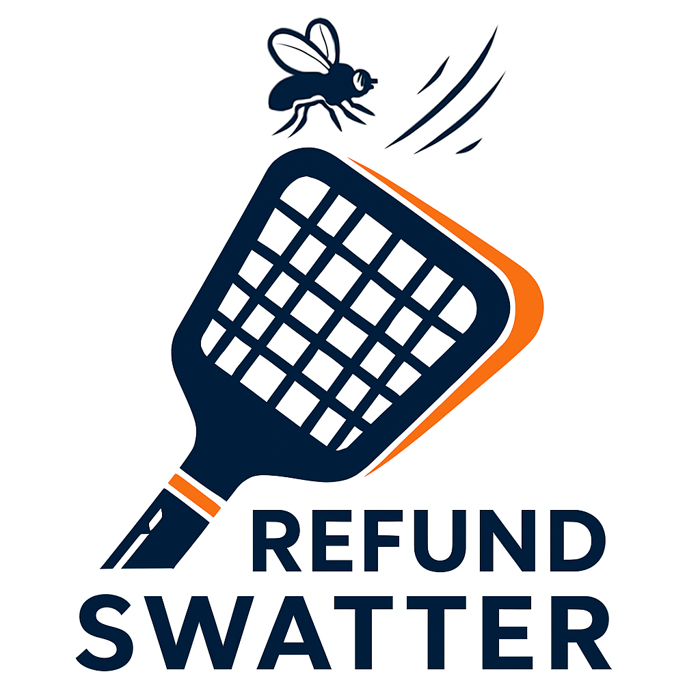

<p align="center">
  <a href="#" title="Refund Swatter Lite">
    
  </a>
</p>

<p align="center">
  <b>Stop fraudulent App Store refunds in real-time — 100% on Supabase.</b>
  <br/>
  <sub>Single-tenant, secure, and easy to set up for one app.</sub>
  <br/>
  <sub>You own your keys — In-App Purchase Keys are never uploaded to any third party.</sub>
</p>

<p align="center">
  <a href="#quick-start"></a>
  <a href="https://youtu.be/bQShJeDM5H0?quality=hd1080&utm_source=producthunt&utm_medium=github&utm_campaign=readme_top" target="_blank"></a>
  <a href="https://github.com/argus-sight/refund-swatter-lite/stargazers"></a>
  <a href="./README_zh.md"></a>
  <a href="#security"></a>
  <a href="https://www.producthunt.com/posts/refund-swatter-lite" target="_blank"></a>
</p>

<p align="center">
  <a href="https://youtu.be/bQShJeDM5H0?quality=hd1080&utm_source=producthunt&utm_medium=github&utm_campaign=readme_hero" target="_blank">
    
  </a>
  <br/>
  <sub>Welcome, Product Hunters! Watch the demo and try the quick setup below.</sub>
</p>

---

# Refund Swatter Lite

[Chinese](./README_zh.md) | English

Simplified single-tenant Apple App Store refund prevention service using Supabase.

## Overview

Refund Swatter Lite significantly reduces malicious refund risks by processing Apple's CONSUMPTION_REQUEST notifications in real-time and sending detailed consumption data back to Apple, enabling Apple to make informed decisions on refund requests.

### Key Features

- **You Own Your Keys (BYOK, Bring Your Own Key)** - Keep your In-App Purchase Keys within your own Supabase project; no third‑party uploads required
- **Real-time Processing** - Instantly handles notifications as they arrive
- **100% Supabase** - No additional servers required  
- **Auto-processing** - Fully automated workflow
- **12 Consumption Fields** - Calculates all required Apple fields
- **Secure Vault Storage** - Private keys encrypted in Supabase Vault
- **Simple Setup** - One configuration file, one setup script

## Why Refund Swatter Lite?

- Real pain: many iOS teams have suffered sudden large-scale refund abuse overnight — hundreds to tens of thousands of dollars, sometimes even leading to app takedowns.
- How it works: after a user requests a refund, Apple sends up to three CONSUMPTION_REQUEST notifications. If developers respond with consumption data in real-time (e.g., cumulative spend, cumulative refunds, developer refund preference), Apple can make a fairer decision and abuse drops significantly.
- Timeline: refund eligibility can extend up to 90 days from purchase; your backend must remain ready throughout that period.
- Gap in existing tools: some platforms (e.g., RevenueCat) automate replies but require uploading the App Store Server API key (AuthKey.p8) and In-App Purchase Key to their cloud, effectively delegating App Store Connect query/operation rights to a third party — unacceptable for security‑sensitive teams.
- Our approach: runs 100% on Supabase with one‑command setup and zero server maintenance; BYOK (Bring Your Own Key) — your In-App Purchase Keys stay only in your Supabase project (Vault/env), never uploaded to any third party.
- Observability: auto‑responds to CONSUMPTION_REQUEST while surfacing field meanings, jobs, and logs for easy debugging and audits.
- Impact: keeps AuthKey/IAP Key safe and meaningfully reduces fraudulent refunds (especially for consumables).

## Quick Start

1. **Clone and configure**
```bash
git clone git@github.com:argus-sight/refund-swatter-lite.git
cd refund-swatter-lite
cp .env.project.example .env.project
# Edit .env.project with your credentials
```

2. **Run setup script**
```bash
./setup-simple.sh
```
The script will output admin credentials (admin@refundswatter.com / ChangeMe123!) - change the password immediately after first login.

3. **Start web dashboard and configure Apple credentials**
```bash
cd web && npm install && npm run dev
```
Then access `http://localhost:3000` to configure Apple credentials

4. **Set webhook URL** in App Store Connect:
   `https://[your-project-ref].supabase.co/functions/v1/webhook`

For detailed setup instructions, see [SETUP_GUIDE.md](./SETUP_GUIDE.md).

## Project Structure

```
refund-swatter-lite/
├── supabase/
│   ├── functions/      # Edge Functions
│   └── migrations/     # Database schema
├── web/                # Next.js dashboard
├── scripts/            # Utility scripts
└── .env.project        # Main configuration
```

## Dashboard Features

- **Overview** - Consumption metrics and system health
- **Notifications** - View and reprocess Apple notifications
- **Test & Initialize** - Test webhook and import historical data
- **Consumption Requests** - Track processing status
- **Settings** - Manage Apple credentials

## Troubleshooting

### Common Issues

**Webhook not receiving notifications**
- Verify webhook URL in App Store Connect
- Check Edge Function logs: `supabase functions logs webhook`
- Ensure Edge Functions are deployed
- Ensure JWT verification is disabled for webhook Edge Function


**Test notification failing**
- Ensure correct environment selected
- Verify Apple credentials are valid
- Check `apple_api_logs` table for errors

## Security

- Private keys encrypted in Supabase Vault
- Authentication verification for all Edge Functions
- Service role keys never exposed to client
- CRON_SECRET protects scheduled endpoints
- No third‑party key upload — In-App Purchase Keys remain in your Supabase project only

## Support

For issues or questions, please open an issue on GitHub.

## 🤝 Contributors

<a href="https://github.com/Yvent">
  
</a>

Thanks to our partners for their valuable suggestions and assistance.

## License

Licensed under the Apache License 2.0. See [LICENSE](./LICENSE) for details.

## Future Plans

- Multi-tenant SaaS: zero-deploy service
- Refund Swatter Pro: risk control system for professional fraud rings
- Have ideas or interested in collaboration? Please open an issue on GitHub - we'd love to hear from you!