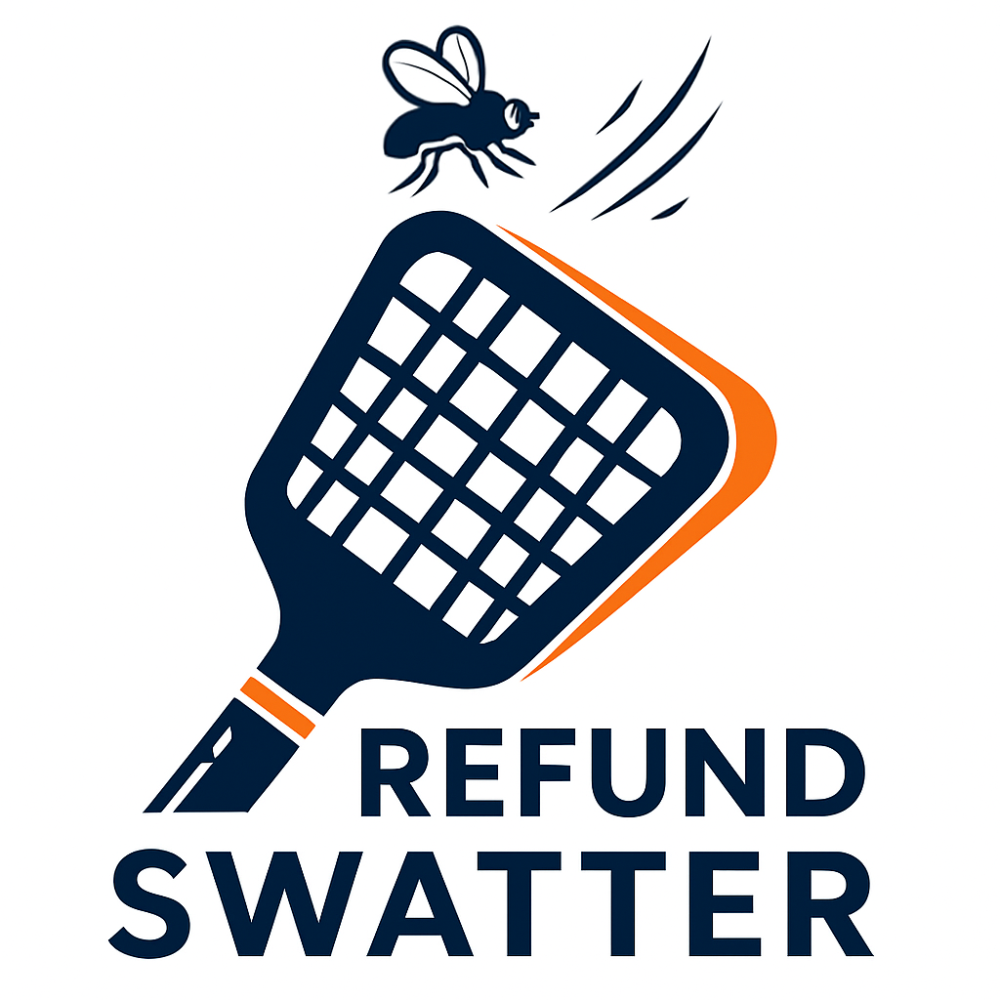

<p align="center">
  <a href="#" title="Refund Swatter Lite">
    
  </a>
</p>

<p align="center">
  <b>实时阻止欺诈性退款 — 100% 基于 Supabase。</b>
  <br/>
  <sub>面向单应用、简单安全、开箱即用。</sub>
  <br/>
  <sub>密钥自持（BYOK）：你的 In-App Purchase Key 不会上传到任何第三方平台。</sub>
</p>

<p align="center">
  <a href="#快速开始"></a>
  <a href="https://www.youtube.com/watch?v=j-88H8j7btI&utm_source=producthunt&utm_medium=github&utm_campaign=readme_top" target="_blank"></a>
  <a href="https://github.com/argus-sight/refund-swatter-lite/stargazers"></a>
  <a href="./README.md"></a>
  <a href="#安全性"></a>
</p>

<p align="center">
  <a href="https://www.youtube.com/watch?v=j-88H8j7btI&utm_source=producthunt&utm_medium=github&utm_campaign=readme_hero" target="_blank">
    
  </a>
  <br/>
  <sub>Product Hunt 访客你好！先看演示，再按下方快速安装。</sub>
</p>

---

# Refund Swatter Lite

简体中文 | [English](./README.md)

基于 Supabase 的简化版单租户 Apple App Store 退款预防服务。

## 概述

Refund Swatter Lite 实时处理 Apple 的 CONSUMPTION_REQUEST 通知，并立即将消费信息发送回 Apple，帮助减少欺诈性退款。

### 主要特性

- **密钥自持（BYOK）** - In-App Purchase Key 仅保存在你的 Supabase 项目内，无需上传到任何第三方平台
- **实时处理** - 立即处理收到的通知
- **100% Supabase** - 无需额外服务器
- **自动处理** - 全自动化工作流程
- **12 个消费字段** - 计算所有必需的 Apple 字段
- **安全保管库存储** - 私钥在 Supabase Vault 中加密
- **简单设置** - 一个配置文件，一个设置脚本

## 为什么是 Refund Swatter Lite？

- 痛点真实存在：不少 iOS 团队遭遇过"隔夜大规模恶意退款"，轻则几百刀、重则上万刀，还可能被下架。
- 关键机制：用户申请退款后，Apple 会向开发者发送最多 3 次 CONSUMPTION_REQUEST；只要实时回复包含消费信息（累计消费/累计退款/开发者偏好等），即可帮助 Apple 更"公平"地决策，从而显著降低恶意退款比例。退款周期最长可达 90 天，因此需要持续覆盖这一周期。
- 现有方案不足：如 RevenueCat 等三方平台虽支持自动回复，但通常需要把 App Store Server API 密钥（AuthKey.p8）与 In-App Purchase Key 上传到其云端，把查询与操作权限交给第三方；对安全敏感团队（含企业）而言难以接受。
- 我们的取舍：本项目 100% 基于 Supabase，一键部署、零服务器维护；密钥自持（BYOK），In-App Purchase Key 仅保存在你的 Supabase 项目（Vault/环境变量）内，绝不上传第三方。
- 可观测与可审计：自动答复 CONSUMPTION_REQUEST 的同时，展示各字段含义、任务与日志，方便排查与回溯。
- 实际收益：在保证 AuthKey 与 IAP Key 安全性的同时，显著减少恶意退款订单（对消耗型尤其明显）。

## 快速开始

### 前置条件

- 已安装 [Supabase CLI](https://supabase.com/docs/guides/cli) 并完成登录（`supabase login`）。
- 系统中可使用 `openssl` 与 `python3`，用于生成随机密钥和解析 JSON。
- 已安装 Node.js 与 npm（可通过 `node --version`、`npm --version` 验证）。

1. **克隆并配置**
```bash
git clone git@github.com:argus-sight/refund-swatter-lite.git
cd refund-swatter-lite
cp .env.project.example .env.project
# 使用你的凭据编辑 .env.project
```

2. **运行设置脚本**
```bash
./setup-simple.sh
```
脚本会输出默认管理员邮箱（`admin@refundswatter.com`）以及自动生成的一次性密码——请妥善保存，并在首次登录后立即修改该密码。

3. **启动 Web 仪表板并配置 Apple 凭据**
```bash
cd web && npm install && npm run dev
```
然后访问 `http://localhost:3000` 配置 Apple 凭据。

4. **在 App Store Connect 中设置 webhook URL**：
   `https://[your-project-ref].supabase.co/functions/v1/webhook`

详细安装说明请参见 [SETUP_GUIDE.md](./SETUP_GUIDE.md)。

## 项目结构

```
refund-swatter-lite/
├── supabase/
│   ├── functions/          # Supabase Edge Functions
│   └── migrations/         # 数据库迁移
├── web/                    # Next.js 仪表板
├── setup-simple.sh         # 引导式 Supabase 设置脚本
├── export_baseline.sh      # 导出当前数据库结构的辅助脚本
└── .env.project.example    # 环境变量模板，复制为 .env.project
```

## 开发环境准备

本地开发依赖 Git 钩子在提交前运行 [`gitleaks`](https://github.com/gitleaks/gitleaks)。在新机器上克隆仓库后请：

1. 安装 Node 依赖并启用 Husky：`npm install && npx husky install`。
2. 安装 `gitleaks` 以便预提交钩子运行。例如在 macOS 上执行 `brew install gitleaks`，或者从 GitHub 项目下载最新 Release 的二进制并加入 `PATH`。

完成上述步骤后，提交会自动扫描暂存文件，防止敏感信息泄露。

## 仪表板功能

- **概览** - 消费指标和系统健康状况
- **通知** - 查看和重新处理 Apple 通知
- **测试与初始化** - 测试 webhook 和导入历史数据
- **消费请求** - 跟踪处理状态
- **设置** - 管理 Apple 凭据

## 故障排除

### 常见问题

**Webhook 未接收到通知**
- 验证 App Store Connect 中的 webhook URL
- 检查 Edge Function 日志：`supabase functions logs webhook`
- 确保 Edge Functions 已部署
- 确保为 webhook Edge Function 禁用了 JWT 验证


**测试通知失败**
- 确保选择了正确的环境
- 验证 Apple 凭据是否有效
- 检查 `apple_api_logs` 表中的错误

## 常见问题 FAQ

更多问答请参阅 [FAQ_zh.md](./FAQ_zh.md)，涵盖本地 Supabase Docker、是否需要 cron 任务以及 `verify_jwt` 配置等问题。

## 安全性

- 私钥在 Supabase Vault 中加密
- 所有 Edge Functions 的身份验证验证
- 服务角色密钥永不暴露给客户端
- CRON_SECRET 保护计划端点
- 不上传密钥到第三方（BYOK） — In-App Purchase Key 仅保存在你的 Supabase 项目中

## 额外说明
v1.0版本是由AI生成的，实现了基本的功能。
v2.0版本代码仍然是AI写的，但是着重优化了安全和性能相关的内容，遵循 Supabase 安全和性能的最佳实践。我符合代码审核并引导AI按照最佳实践完成。核心代码都添加了详细的注释，便于理解和维护。

感谢AI的发展，让我能独立完成这样一个有趣的项目。

## 许可证

根据 Apache License 2.0 授权，详见 [LICENSE](./LICENSE)。

## 支持

如有问题或疑问，请在 GitHub 上提交 issue。

## 未来计划

- 开发多租户的 SaaS 服务：免部署
- 开发 Refund Swatter Pro 版本：面向专业黑灰产团伙的风控系统
- 有其它想法或对合作感兴趣？请在 GitHub 上提交 issue - 我们非常期待您的反馈！
